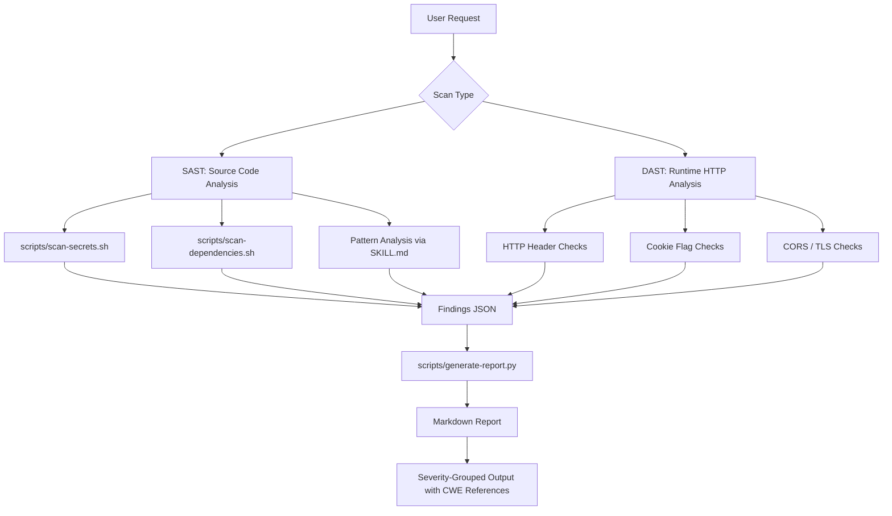

# SAST/DAST Security Scanner

A comprehensive security vulnerability scanning skill for Claude Code that integrates Static Application Security Testing (SAST) and Dynamic Application Security Testing (DAST) capabilities.

## Overview

This skill enables Claude to identify and report security vulnerabilities across codebases, configurations, and applications without running code (SAST) and through runtime analysis (DAST).

### Key Features

- **SAST Analysis**: Code pattern matching for 40+ vulnerability types
- **Dependency Auditing**: npm, pip, cargo, Maven, Gradle vulnerability detection
- **Secrets Detection**: API keys, credentials, tokens, database URLs
- **DAST Checks**: HTTP headers, cookies, CORS, redirects, information disclosure
- **Multi-Language**: JavaScript/TypeScript, Python, Java, Go, Rust, and more
- **OWASP Mapping**: Top 10 (2021) and Top 10 for LLM Applications (2025)
- **Structured Reports**: Executive summaries, risk scoring, remediation guidance

## Project Structure

```
sast-dast-scanner/
├── skills/sast-dast-scanner/
│   ├── SKILL.md                    # Skill definition & patterns
│   ├── references/
│   │   ├── owasp-top10-web.md      # Web app checklist
│   │   ├── owasp-top10-llm.md      # LLM app checklist
│   │   ├── sast-patterns.md        # Vulnerability patterns
│   │   └── dast-checklist.md       # Runtime testing guide
│   └── scripts/
│       ├── scan-dependencies.sh    # Dependency auditing
│       ├── scan-secrets.sh         # Secret pattern detection
│       └── generate-report.py      # Report generation
├── evals/evals.json                # Test cases
├── README.md                        # This file
└── LICENSE                          # MIT License
```

## Installation

```bash
git clone git@github.com:justice8096/sast-dast-scanner.git ~/.claude/plugins/sast-dast-scanner
```

## How It Works



## Usage

### Security Scan

```bash
# Run SAST on codebase
claude-code run sast-dast-scanner --scan /path/to/code

# Scan dependencies
./skills/sast-dast-scanner/scripts/scan-dependencies.sh /path/to/code

# Search for secrets
./skills/sast-dast-scanner/scripts/scan-secrets.sh /path/to/code

# Generate report
cat findings.json | python3 skills/sast-dast-scanner/scripts/generate-report.py
```

### Triggering Conditions

The skill activates when Claude detects:
- "security scan", "vulnerability check", "is my code secure"
- "audit this code", "check for injection", "find security issues"
- "pen test", "security review", "OWASP", "pentesting"
- Code handling user input, authentication, or network requests
- Requests for CWE/CVE analysis or security assessment

## Capabilities

### SAST (Static Analysis)

| Category | Detection |
|----------|-----------|
| **Injection** | SQL, XSS, command injection, path traversal, LDAP injection |
| **Insecure Deserialization** | Unsafe pickle, eval, JSON.parse with reviver issues |
| **Secrets** | AWS keys, GitHub tokens, JWT secrets, database passwords |
| **Cryptography** | Weak algorithms, hardcoded keys, insecure randomness |
| **Input Validation** | Missing validation, insufficient sanitization |
| **Regex DoS** | Catastrophic backtracking patterns |
| **Race Conditions** | TOCTOU, unchecked state transitions |
| **Type Confusion** | Unsafe type coercion, prototype pollution |

### DAST (Dynamic Analysis)

- HTTP Security Headers (CSP, HSTS, X-Frame-Options, etc.)
- Cookie Security Flags (HttpOnly, Secure, SameSite)
- CORS Misconfiguration Detection
- Open Redirect Vulnerabilities
- Information Disclosure (headers, stack traces, debug mode)
- Authentication/Session Weakness
- Rate Limiting Absence

## Reference Materials

- **[OWASP Top 10 2021](./skills/sast-dast-scanner/references/owasp-top10-web.md)** - Web application security checklist
- **[OWASP Top 10 for LLM Applications 2025](./skills/sast-dast-scanner/references/owasp-top10-llm.md)** - LLM-specific vulnerabilities
- **[SAST Patterns](./skills/sast-dast-scanner/references/sast-patterns.md)** - Language-specific vulnerability patterns
- **[DAST Checklist](./skills/sast-dast-scanner/references/dast-checklist.md)** - Dynamic testing procedures

## Report Output

Findings include:
- **Severity**: CRITICAL, HIGH, MEDIUM, LOW, INFO
- **CWE ID**: Common Weakness Enumeration mapping
- **OWASP Category**: Top 10 or LLM Top 10 alignment
- **Risk Score**: Composite risk assessment
- **Remediation**: Actionable guidance and code examples

Example:
```markdown
## CRITICAL: SQL Injection in User Search

**CWE**: CWE-89 (SQL Injection)
**OWASP**: A03:2021 - Injection
**Lines**: src/users.ts:42-45

Risk Score: 9.5/10

**Description**: User input directly concatenated into SQL query...
**Remediation**: Use parameterized queries with prepared statements...
**Code Example**: [See report]
```

## Evals

Three comprehensive test cases validate scanning accuracy:

1. **Node.js Express App** - SQL injection, missing Helmet headers, hardcoded JWT
2. **Python Flask App** - Command injection, SSRF, debug mode enabled
3. **React Frontend** - XSS via dangerouslySetInnerHTML, open redirect, localStorage tokens

Run evals:
```bash
claude-code eval evals/evals.json
```

## Security Considerations

- This tool identifies potential vulnerabilities; human review is essential
- False positives occur; each finding requires context evaluation
- Absence of findings doesn't guarantee security
- Use alongside other security tools in defense-in-depth strategy
- Keep OWASP and CWE references current

## Requirements

- Claude Code
- Bash shell
- Python 3.6+
- Package managers (npm, pip, cargo, mvn, gradle) for dependency scanning

## License

MIT License - See LICENSE file for details

## Contributing

Contributions welcome! Areas for enhancement:
- Additional language support (C#, PHP, Ruby, Swift)
- Integration with external SAST tools (Semgrep, SonarQube)
- CI/CD pipeline templates
- Additional DAST runtime checks

---

**Created by**: Justice
**Last Updated**: 2026-03-28
